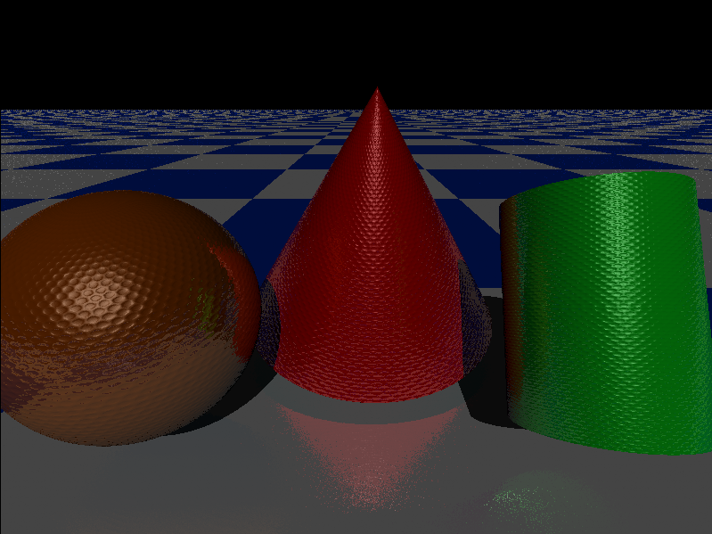
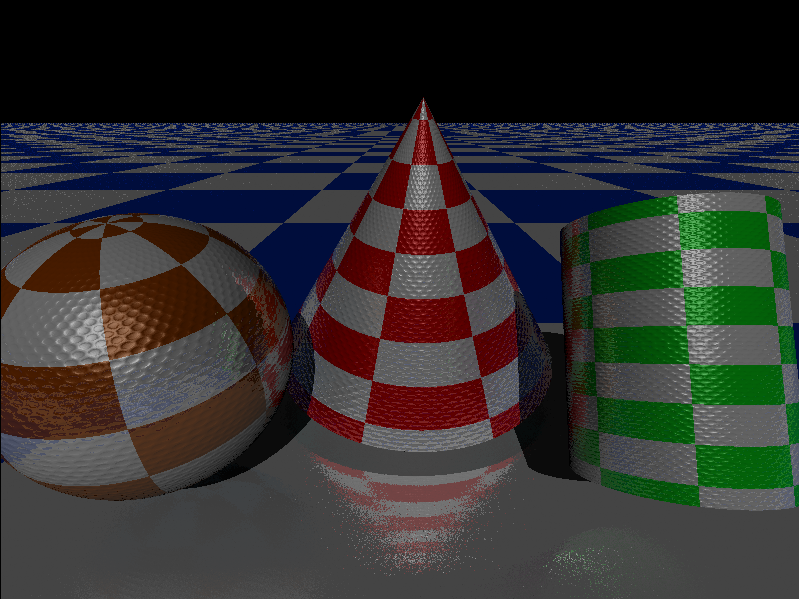
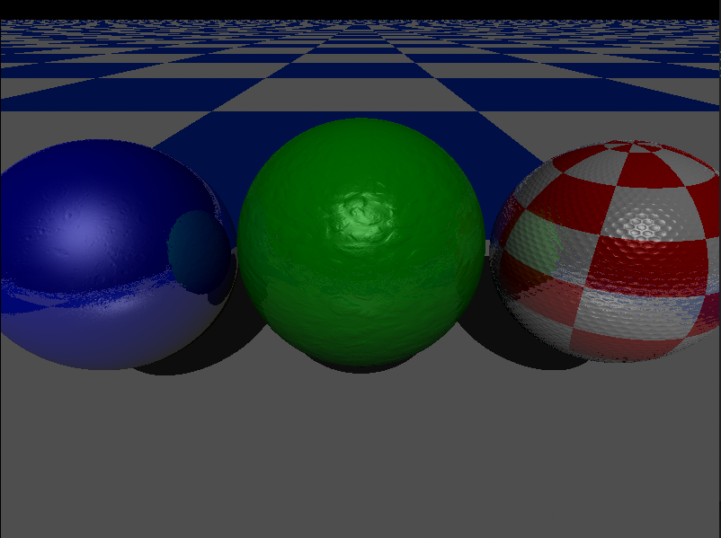

# MINIRT
## Description
A simple raytracing engine using phongs lighting model. Supports checkerboarding, simple reflections and bump maps.
Ability to drag and dynamically apply simple transformations like scaling, rotations and translations on objects in the scene.




## Table of Contents
1. [Requirements](#installation)
2. [Installation](#requirements)
3. [Usage](#usage)

## Requirements
- **libbsd-dev**: Required for building the project on Linux

## Installation
### On Ubuntu
1. **Clone repository:**
```
git clone https://github.com/chalant/miniRT.git
```
2. **Install dependencies:**
```
sudo apt-get install libbsd-dev
```
3. **Build project:**
```
make
```
### On Mac OS

1. **Clone repository:**
```
git clone https://github.com/chalant/miniRT.git
```
2. **Build project:**
```
make
```
## Usage
```
./minirt [file-path]
```
## Example
```
./minirt map.rt
```
